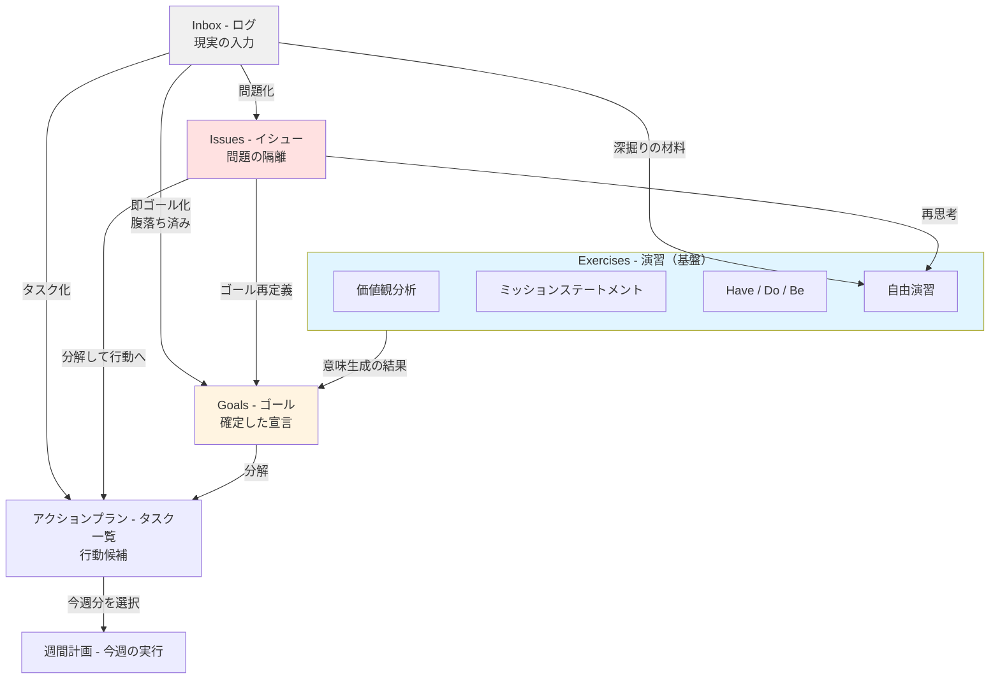
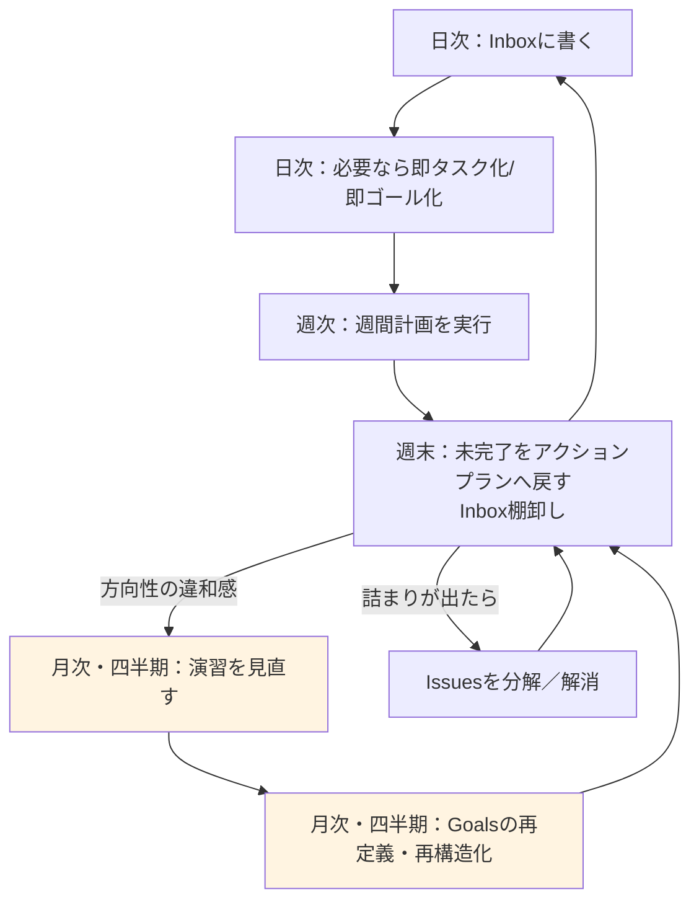
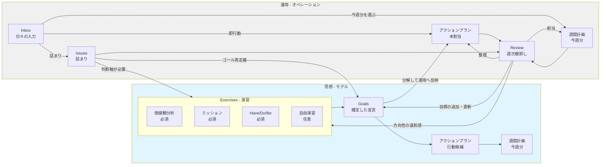
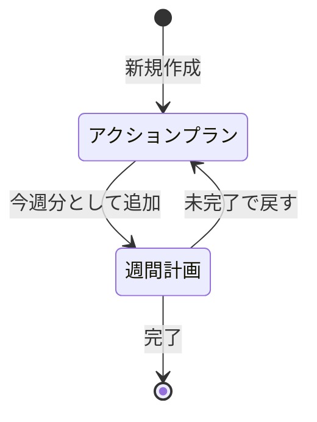
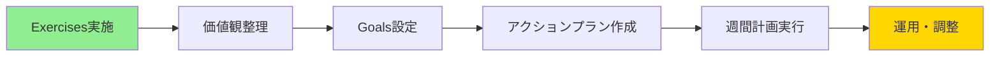
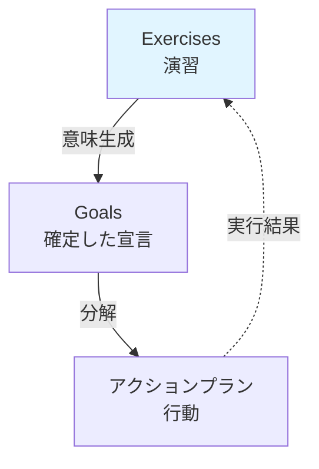
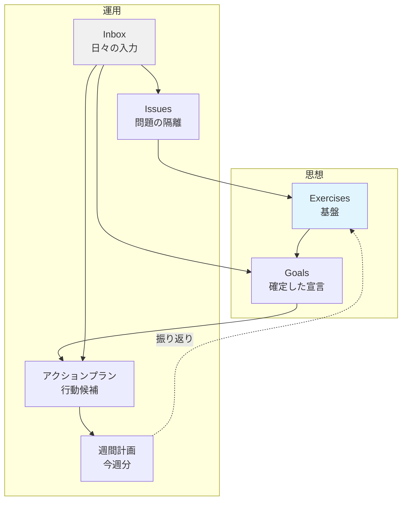

# LifePlanner ユーザーマニュアル
― 人生を設計し、日常を運用するためのガイド ―

## 0. LifePlannerとは何か

LifePlannerは、**人生を「考える → 決める → 実行する」ための設計・運用ツール**です。

単なるタスク管理ではなく、

- 価値観やミッションを言語化し
- そこからゴールを定義し
- 日々の出来事や課題を現実的に処理しながら
- 行動として実行する

ことを目的としています。

### 二つのスタート地点

LifePlannerには**二つの正規スタート地点**があります。

- **価値観分析スタート（原理的）**: Exercisesから始める
- **Inboxスタート（現実的）**: Inboxから始める

どちらから始めても問題ありません。  
ただし**最終的には同じ構造（Goalsと価値観）に収束**します。

---

## 1. 全体構造

### 1.1 思想モデル（構造）



### 1.2 運用フロー（オペレーション）



### 1.3 全体接続図（思想と運用の関係）



---

## 2. コンポーネント詳細

### 2.1 Inbox（ログ）

**役割**  
日常の出来事・思考・感情・課題を、判断せずに書く場所。LifePlannerの入口。

**書くもの**
- 思いつき
- 違和感
- 感情
- メモ
- 突発タスク

**特徴**
- 未整理OK
- 未確定OK
- 時系列ストリーム
- 完璧を求めない

**次の行き先**
- **Exercises**: 考える必要がある
- **アクションプラン**: 即行動できる
- **Goals**: すでに腹落ちしている
- **Issues**: 問題として詰まっている

**使い方**
- その場で判断しない
- とにかく書き出す
- 定期的に整理してIssues/Goals/アクションプランに振り分け

---

### 2.2 Exercises（演習）

**LifePlannerの中核**です。**目標を書くために考える場所**です。

#### 2.2.1 基盤演習（必須）

人生設計の土台になる演習です。

**価値観分析**
- 自分が大切にしていること
- 判断軸の言語化

**ミッションステートメント**
- 人生の目的
- 自分の使命

**Have / Do / Be**
- 持ちたいもの（Have）
- やりたいこと（Do）
- なりたい姿（Be）

**役割**
- 判断軸を作る
- ゴールの正当性を担保する

**特徴**
- 半固定（頻繁には変わらない）
- 更新頻度は低い（月次・四半期）
- すべてのGoalsの上位に位置する

---

#### 2.2.2 自由演習（任意）

思考を広げ、ゴールの材料を作るための演習です。

**例**
- 余命1年リスト
- あと100年人生リスト
- 死ぬまでにやりたいこと
- 憧れの人物
- 立場を変えて考える
- 20年後の自分へインタビュー
- 心に残った言葉・座右の銘

**特徴**
- 書き方自由
- 結論不要
- 矛盾OK
- 視野を広げることが目的

**使い方**
- Inboxで出た違和感を深掘り
- Issuesの再思考に使う
- 定期的に見返して気づきを得る

---

### 2.3 Goals（ゴール）

**役割**  
演習を経て確定した「宣言」を構造化する場所。

**書くもの**
- 人生 / 長期 / 中期 / 年間 / 四半期 / 月間 / 週間ゴール
- 「これは自分のゴールだ」と言い切れるもの

**書かないもの**
- 迷っている願望 → Exercises
- 思考途中のメモ → Inbox
- 分解できない問題 → Issues

**原則**
- ゴールは演習由来であることが望ましい
- Inbox直行も可（後から演習に接続すればOK）

**使い方**
- 階層化して親子関係を整理
- 期限と成果物を明確化
- ドラッグ&ドロップで並び替え
- 定期的に進捗確認

**ポイント**
- SMARTな目標設定（具体的・測定可能・達成可能・関連性・期限）
- 大目標→中目標→小目標に分解

---

### 2.4 Issues（イシュー）

**役割**  
ゴールにも行動にも落とせない「問題」を隔離する場所。

**書くもの**
- 分解できない課題
- 判断保留の詰まり
- ボトルネック

**例**
- 転職したいが方向性が定まらない
- このゴールは現実的に無理がある
- やりたいことが見つからない

**目的**
- 問題を無理にアクションプランに入れないための安全装置
- 考える時間を確保するためのバッファ

**処理方法**
- **再思考**: Exercisesで深掘り
- **ゴール再定義**: Goalsに変換
- **分解**: 小さくしてアクションプランへ

**ポイント**
- Issuesは悪ではない
- 溜まっていても問題ない
- 定期的に見直して処理

---

### 2.5 アクションプラン（タスク一覧）

**役割**  
ゴールを現実に落とすための行動候補（バックログ）。

**書くもの**
- 1〜数時間単位の行動
- 調査・試行・作業
- 具体的な次のステップ

**特徴**
- 今週やるとは限らない
- 溜まっていても問題ない
- バックログとして機能

**使い方**
- Goalsから分解して作成
- 優先順位を設定
- 今週やるものを週間計画に追加する

**ポイント**
- 1タスク = 1-2時間で完了する粒度
- 次のアクションが明確
- 週間計画に落としやすい形式

---

### 2.6 週間計画

**役割**  
今週やると決めたアクションプランを集めたビュー。

**重要な前提**
- 週間計画はアクションプランのタスクから今週分を選ぶ
- 今週分は週間計画側で管理する

**構成要素**
- テーマ: 今週の重点テーマ
- ルーティン: 毎週やるべきこと
- 役割: 仕事・家族・個人などの役割ごとの予定
- 振り返り: 週末に記録
- 日付メモ: 毎日の出来事

**使い方**
- アクションプランから今週分を選んで週間計画に追加
- 実行可能な量に調整（詰め込みすぎない）
- 週末に未完了をアクションプランへ戻す

**ポイント**
- 毎週同じ曜日・時間に作成する習慣
- 達成率を上げることを優先
- 完璧を求めない

---

## 3. 状態モデル

**アクションプランと週間計画の関係**

```
アクションプラン
- 内容
- 紐づくGoal（任意）

週間計画
- 今週やるタスクを選んで配置
```

- アクションプラン → 週間計画（今週分を追加）
- 週間計画 → アクションプラン（未完了を戻す）

**状態遷移**



---

## 4. スタート方法（二つの正規ルート）

### 4.1 Inboxスタート（現実的）

**こんな人におすすめ**
- まず動き出したい
- 価値観の整理は後回しでOK
- 日々の記録から始めたい


**ステップ1: まず記録を始める（1-2週間）**

- Inboxに思いついたことを全て記録
- 今週やることを週間計画に追加
- 日付メモで毎日の出来事を記録
- 整理は後回しでOK

**ステップ2: パターンを見つける（2-4週間）**

- 繰り返し出てくる課題 → **Issues**
- 達成したいこと → **Goals**
- すぐやること → **アクションプラン**（今週分は週間計画へ）

**ステップ3: 価値観を言語化する（1ヶ月後）**

- Exercisesで自己分析
- なぜその課題に取り組むのか
- 何を大切にしているのか
- 基盤演習（価値観分析・ミッション・Have/Do/Be）を実施

**ステップ4: 全体を整理する**

- Exercisesを基準にIssues/Goals見直し
- 価値観に合わないものは削除・保留
- アクションプランを整理して週次運用へ

---

### 4.2 価値観分析スタート（原理的）

**こんな人におすすめ**
- じっくり設計したい
- 価値観から整理したい
- 計画的に進めたい



**ステップ1: 価値観を整理する**

- **基盤演習を実施**
  - 価値観分析: 大切にしたいこと
  - ミッションステートメント: 人生の目的
  - Have/Do/Be: 持ちたい・やりたい・なりたい
- 判断基準を明文化

**ステップ2: 価値観から目標を導く**

- Exercisesを見ながらGoals設定
- 価値観を実現するための目標
- 期限と成果物を明確化
- 階層化して整理

**ステップ3: 実行計画を立てる**

- Goalsからアクションプラン作成
- 1-2時間で完了する粒度に分解
- 優先順位を設定

**ステップ4: 週次運用を開始**

- アクションプランから今週やることを選択
- 週間計画で実行
- 振り返りで改善

---

## 5. 基本的な使い方（運用フロー）

### 日次運用（5-10分）

**Inboxに書く**
- 出来事、思いつき、違和感、感情をそのまま記録
- その場で判断しなくてよい
- 明確に「やること」だと分かるものだけアクションプランにする

**日付メモ記録**
- 今日やったこと
- 気づいたこと
- 明日への引き継ぎ

**翌日準備**
- 週間計画の確認
- 優先タスクの確認

---

### 週次運用（30-60分）- 中核

**週末振り返り**
- 週間計画の達成状況確認
- 完了したものは完了
- 未完了のものは週間計画から外してアクションプランに戻す

**Inbox棚卸し**
- Inboxを見返して以下を判断
  - 考える必要がある → **Exercises**
  - 問題として詰まっている → **Issues**
  - 行動にできる → **アクションプラン**
  - 目標として確定 → **Goals**

**週間計画作成**
- 今週のテーマ設定
- アクションプランから今週やることを選択
- ルーティンタスクの確認
- 実行可能な量に調整

---

### 月次・四半期運用（1-2時間）

**基盤演習の点検・更新**
- 価値観分析
- ミッションステートメント
- Have / Do / Be

**自由演習で視野を広げる**
- 新しい気づきの記録
- 価値観の変化確認

**Goals整理**
- 達成したGoalsのアーカイブ
- 新しいGoals追加
- 優先順位見直し

**Issues重点処理**
- 分解できるものはアクションプラン化
- 再思考が必要なものはExercises化
- ゴール再定義

---

## 6. 判断に迷ったときのガイド

| 状態                     | 行き先        | 理由                   |
| ------------------------ | ------------- | ---------------------- |
| まだ考え中・メモ         | **Inbox**       | 判断不要、とにかく記録 |
| 目標を書くために考えたい | **Exercises** | 思考を深める場所       |
| すでに腹落ちしている宣言 | **Goals**     | 確定した目標           |
| 行動に落とせない問題     | **Issues**    | 安全に隔離             |
| 手を動かす具体的行動     | **アクションプラン**   | バックログ             |
| 今週やると決めた         | **週間計画**    | 今週分として追加       |

---

## 7. 設計思想（使い続けるための前提）

### 7.1 入口は自由、構造は厳密

**入口の自由**
- 価値観分析から始めてもよい
- 日々のInboxから始めてもよい
- どちらも正しいスタート

**構造の厳密性**
- ゴールは最終的に価値観と接続される
- アクションプランはタスク一覧、週間計画で今週分を管理する
- Exercisesがすべての中心にある

---

### 7.2 演習がすべての中心



**Exercisesの位置づけ**
- ゴールはExercisesから生まれる
- 行動はGoalsに従属する
- 実行結果はExercisesにフィードバックされる

**なぜExercisesが中心なのか**
- 目標の正当性を担保する
- 判断軸を提供する
- 人生の方向性を決める

---

### 7.3 行動は状態で管理

**アクションプランと週間計画の本質**

```
週間計画 ≠ 別のリスト
週間計画 = アクションプランの今週分
```

**この設計の利点**
- データの重複がない
- 状態遷移が明確
- 週次運用がシンプル

**状態管理の原則**
- 完了したら完了（削除または保管）
- 未完了なら週間計画から外す
- 溜まっているアクションプランは悪ではない

---

### 7.4 Issuesは安全装置

**なぜIssuesが必要か**

問題をアクションプランに無理に入れると:
- 実行できないタスクが溜まる
- 週次運用が機能しなくなる
- ストレスが増える

**Issuesの役割**
- ボトルネックを可視化
- 考える時間を確保
- 無理な実行を防ぐ

**Issuesの処理方針**
- 急いで解決しなくてよい
- 定期的に見直す
- Exercisesで再思考する

---

## 8. よくある質問

**Q: Inboxと週間計画の日付メモの違いは？**

A: 
- **Inbox**: 未整理の情報全般（思いつき、違和感、メモ）
- **週間計画の日付メモ**: 日々の出来事の記録（振り返り用）

Inboxは後で整理してIssues/Goalsに変換しますが、日付メモは振り返りのための記録として残します。

---

**Q: すべての機能を最初から使う必要がありますか？**

A: いいえ。

- **Inboxスタート**: Inbox → 週間計画 → 日付メモ から開始
- **価値観スタート**: Exercises → Goals → アクションプラン → 週間計画

段階的に機能を追加していけます。

---

**Q: Exercisesが定まっていない場合はどうすれば？**

A: まずInboxから運用を開始してください。

1. 1-2ヶ月Inboxを記録
2. パターンが見えてくる
3. その後Exercises実施
4. 日々の記録から価値観が見えてきます

---

**Q: Issuesがたまりすぎて困っています**

A: Issuesは悪ではありません。

- 定期的に見直す（月次・四半期）
- Exercisesを見ながら「本当に解決すべき課題か」確認
- 価値観に合わないものは削除・保留でOK
- 分解できるものはアクションプラン化

---

**Q: 週間計画が達成できません**

A: 詰め込みすぎの可能性があります。

- 最初は少なめに設定
- 達成率を上げることを優先
- 完了体験を積み重ねる
- 徐々に量を調整

---

**Q: Goalsとアクションプランの粒度の違いは？**

A:
- **Goals**: 達成したい状態・結果（数週間〜数年）
- **アクションプラン**: 具体的な行動（1-2時間）

例:
- Goal: 「英語で日常会話ができるようになる」
- アクションプラン: 「英単語50個暗記」「オンライン英会話1回受講」

---

**Q: Exercisesはいつ更新すればいいですか？**

A:
- **基盤演習**: 月次・四半期で点検
- **自由演習**: 違和感を感じたときに随時

価値観は変化してもOKです。定期的に見直すことが重要です。

---

## 9. 運用のコツ

### 習慣化のポイント

**週次レビューを固定する**
- 毎週同じ曜日・時間に実施
- 例: 日曜夜20:00-21:00
- カレンダーに予定として入れる

**完璧を求めない**
- 80%できればOK
- 継続することが最優先
- 柔軟に調整する

**小さく始める**
- すべての機能を最初から使わない
- まずはInbox → 週間計画
- 徐々に機能を追加

**定期的に運用方法を改善**
- 月次で振り返り
- 運用方法自体を見直す
- 自分に合った形に調整

---

### つまずきやすいポイント

**Inboxが整理できない**

原因:
- 一度に整理しようとしている
- 完璧を求めている

対策:
- 週1回、15分の整理タイムを確保
- 重要なものだけ整理すればOK
- すべて整理する必要はない

---

**目標が達成できない**

原因:
- 目標が大きすぎる
- アクションプランが具体的でない

対策:
- 目標を小さく分解
- 次のアクションを明確にする
- 1-2時間で完了する粒度に

---

**続かない**

原因:
- 負担が大きすぎる
- 成果が見えない

対策:
- 機能を減らす（Inbox + 週間計画だけでもOK）
- 小さな達成を記録・祝う
- 完璧を求めない

---

**価値観が定まらない**

原因:
- いきなりExercisesから始めた
- 十分な材料がない

対策:
- まずInboxから運用開始
- 1-2ヶ月記録を蓄積
- その後Exercises実施
- 日々の記録が材料になる

---

## 10. まとめ

LifePlannerは、**「正しい答え」を与えるツールではありません**。

**提供するもの**
- 考えるための場所（Exercises）
- 決めたことを管理する構造（Goals）
- 実行できる仕組み（アクションプラン → 週間計画）
- 現実の揺らぎを受け止める受け皿（Inbox / Issues）

**人生を継続的に設計・運用するため**のツールです。

---

### 最終的な構造（収束地点）

どちらのスタートから始めても、最終的にはこの構造に収束します:



**使い方は人それぞれでよい**

ただしこの構造を守ることで:
- 迷いにくく
- 振り返りやすく
- 長く使い続けられる

設計になっています。

---

### 今日から始める

**Inboxスタート（現実的）**
1. Inboxに今日の出来事を書く
2. 明日やることをアクションプランに書く
3. 今週やるものを週間計画に追加する

**価値観スタート（原理的）**
1. Exercisesを開く
2. 価値観分析を実施
3. Goalsを設定する

**どちらでもOKです。まず始めてください。**
